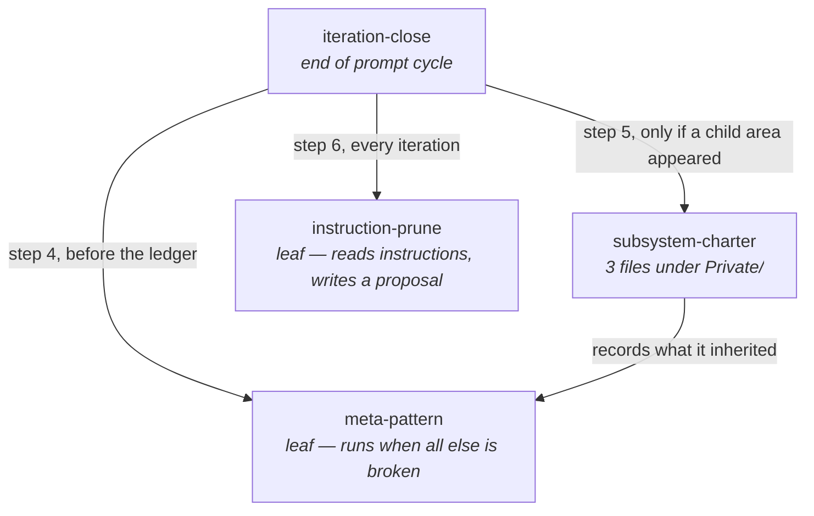

# Skills

Four skills, holding what used to live as prose in `CLAUDE.md` or as nothing at
all. Each one exists because its absence produced a specific, recent failure.

A skill's body loads only when it is invoked, which is why a procedure belongs
here and a fact belongs in `CLAUDE.md`. The split is deliberate: **the skill
holds the ritual, `CLAUDE.md` holds the rule.** Duplicating either into the
other is the accretion `instruction-prune` exists to stop.

## The four

| Skill | Triggers on | Depends on |
| --- | --- | --- |
| [`iteration-close`](iteration-close/SKILL.md) | the end of any prompt cycle; `/iteration-close` | `meta-pattern`, `subsystem-charter`, `instruction-prune` |
| [`meta-pattern`](meta-pattern/SKILL.md) | invoked by `iteration-close`; something feeling familiar at a different scale | — |
| [`subsystem-charter`](subsystem-charter/SKILL.md) | a `Private/` directory reaching three files; any new top-level directory; the charter test failing | `meta-pattern` |
| [`instruction-prune`](instruction-prune/SKILL.md) | invoked by `iteration-close`, every iteration | — |

Two leaves, one root, one interior node. `meta-pattern` is reachable by two
paths and depends on nothing — that is deliberate, not incidental. It has to be
runnable when the build is red and the ledger cannot be written, because the
iterations worth recording a pattern from are disproportionately the ones that
went wrong.

## Why each exists

**`iteration-close` — because the ritual was unwritten and one part of it was
undocumented entirely.** Eight actions end every prompt cycle here. Seven were
prose scattered across three sections of `CLAUDE.md`; the eighth — staging and
committing with a message worth reading — was written down nowhere. A habit
nothing enforces is a habit one tired session ends, and one already did:
`git add -A` swept a stray `coverage.xml` into a commit titled `asdf`. The rules
now live in the **Commit** section of `CLAUDE.md`; the order of operations lives
in the skill.

**`meta-pattern` — because patterns were discovered and then lost.** The same
idea has been rediscovered at three different scales in this repository, and
each time it was written into whichever local comment happened to be in front of
the author: a doc-comment in `Test-KnowledgeDocument`, a rule in `NAMING.md`, a
paragraph in `CLAUDE.md`. Nothing collected them, so the next scale rediscovered
each one from scratch. The ledger records what happened to the store; nothing
recorded what the implementer understood. The two-scale bar is what keeps the
log from filling with one-off profundities.

**`subsystem-charter` — because the intent did not propagate downward.**
`docs/html-architecture.md` is the only subsystem charter and it exists because
a prompt asked for it. `Private/EditorLink/` and `Private/Knowledge/` are the
same shape — many files, a shared contract, a seam — and went two versions with
none. When the next child area appears the same thing happens: nothing, until
someone notices. `tests/Private/SubsystemCharter.Tests.ps1` turns the trigger
into a red build, so noticing is no longer required.

**`instruction-prune` — because `CLAUDE.md` only grew.** 835 lines,
monotonically increasing across every version, with two sections both named
Kaizen and a paragraph in each explaining that the other exists — the file
apologising for its own structure. Every iteration added and none ever removed,
and the whole file is read at the start of every session. This is the
counter-force. It reports the line count as a number so the trend stops being a
feeling, and it proposes rather than deletes, because a deletion decided and
applied in the same turn is the one edit nobody reviews.

## Frontmatter

These follow the Claude Code skill frontmatter schema: every field is optional,
`description` is recommended, and `when_to_use` is appended to `description` in
the skill listing. The command name comes from the **directory** name for
personal and project skills — the `name` field only sets the display label — so
renaming a skill means renaming its directory. See
<https://code.claude.com/docs/en/skills>.

None of the four declares `allowed-tools`. A project skill's `allowed-tools`
grant applies in any session that invokes it, including in a folder that has
never been trusted, so a checked-in skill that pre-approves `Bash(git *)` is a
grant to every future clone. The prompts these skills produce go through the
normal permission flow instead.
