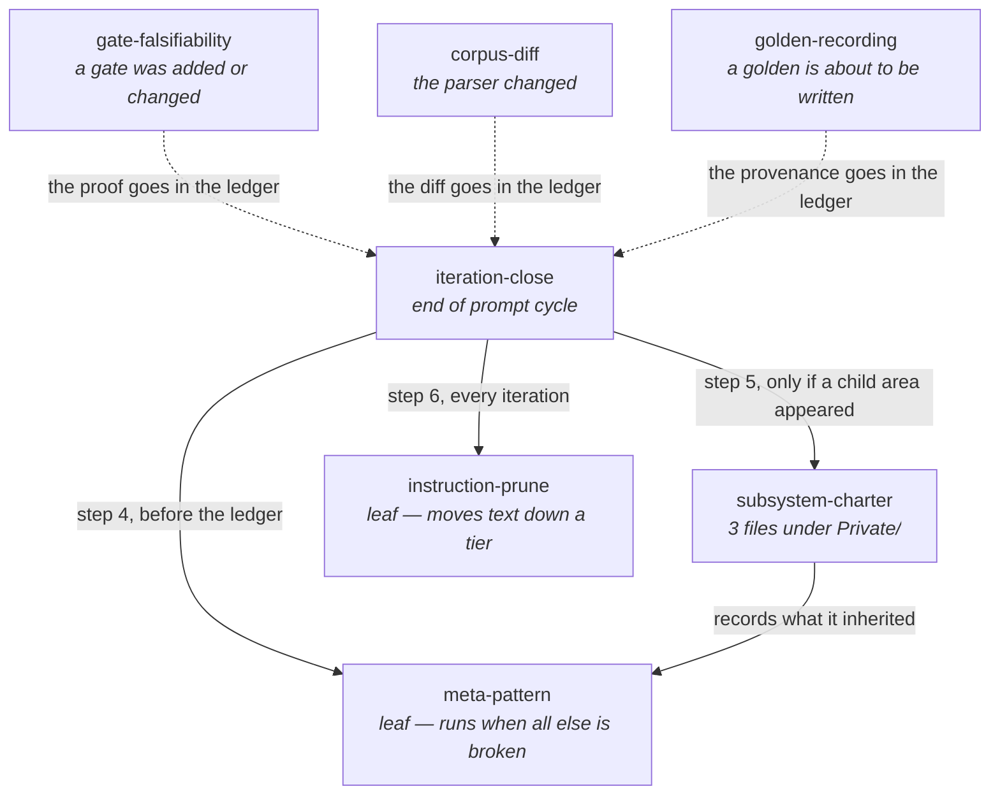

# Skills

Seven skills, holding what used to live as prose in `CLAUDE.md`, as a comment in
whichever file was open, or as nothing at all. Each one exists because its
absence produced a specific, recent failure.

A skill's body loads only when it is invoked, which is why a procedure belongs
here and a fact belongs in `CLAUDE.md`. The split is deliberate: **the skill
holds the ritual, `CLAUDE.md` holds the rule.** Duplicating either into the
other is the accretion `instruction-prune` exists to stop.

## The seven

Four close an iteration. Three record a procedure that had been reconstructed
from memory every time it was needed.

| Skill | Triggers on | Depends on |
| --- | --- | --- |
| [`iteration-close`](iteration-close/SKILL.md) | the end of any prompt cycle; `/iteration-close` | `meta-pattern`, `subsystem-charter`, `instruction-prune` |
| [`meta-pattern`](meta-pattern/SKILL.md) | invoked by `iteration-close`; something feeling familiar at a different scale | — |
| [`subsystem-charter`](subsystem-charter/SKILL.md) | a `Private/` directory reaching three files; any new top-level directory; the charter test failing | `meta-pattern` |
| [`instruction-prune`](instruction-prune/SKILL.md) | invoked by `iteration-close`, every iteration; the byte budget failing | — |
| [`gate-falsifiability`](gate-falsifiability/SKILL.md) | a gate added or changed; a gate green for several iterations with nobody breaking it | — |
| [`golden-recording`](golden-recording/SKILL.md) | recording or re-recording a golden; a golden failing and re-recording being considered | — |
| [`corpus-diff`](corpus-diff/SKILL.md) | any change to extraction, node identity, edge resolution or the graph shape | — |

**The three new ones are not in the closing ritual and must not be.** They fire
on the *work*, not on the end of it — a gate is proved in the turn it is
written, not in the turn the tag is cut. The dotted edges say only where their
output lands. Wiring them into `iteration-close` would move each proof one turn
behind the change it is about, which is exactly the failure that made
`instruction-prune` idle for four versions.

## Why each exists

**`iteration-close` — because the ritual was unwritten and one part of it was
undocumented entirely.** Eight actions end every prompt cycle here. Seven were
prose scattered across three sections of `CLAUDE.md`; the eighth — staging and
committing with a message worth reading — was written down nowhere. A habit
nothing enforces is a habit one tired session ends, and one already did:
`git add -A` swept a stray `coverage.xml` into a commit titled `asdf`. The rules
now live in the **Commit** section of `CLAUDE.md`; the order of operations lives
in the skill.

**`meta-pattern` — because patterns were discovered and then lost.** The same
idea has been rediscovered at three different scales in this repository, and
each time it was written into whichever local comment happened to be in front of
the author: a doc-comment in `Test-KnowledgeDocument`, a rule in `NAMING.md`, a
paragraph in `CLAUDE.md`. Nothing collected them, so the next scale rediscovered
each one from scratch. The ledger records what happened to the store; nothing
recorded what the implementer understood. The two-scale bar is what keeps the
log from filling with one-off profundities.

**`subsystem-charter` — because the intent did not propagate downward.**
`docs/html-architecture.md` is the only subsystem charter and it exists because
a prompt asked for it. `Private/EditorLink/` and `Private/Knowledge/` are the
same shape — many files, a shared contract, a seam — and went two versions with
none. When the next child area appears the same thing happens: nothing, until
someone notices. `tests/Private/SubsystemCharter.Tests.ps1` turns the trigger
into a red build, so noticing is no longer required.

**`instruction-prune` — because `CLAUDE.md` only grew, and the first version of
this skill could not stop it.** 46,681 bytes at v0.3.0, monotonically
increasing, read in full before every session does anything. The v0.3.0 version
proposed *deletions* for a later iteration to apply, and idled: a counter-force
one turn behind a force that acts every turn is a formality with a good
conscience, and — the real reason — **deletion has a defender.** Every line was
written because something went wrong, so the honest answer to "may I delete
this" is almost always no. At v0.4.0 a prune became a **move down a tier**,
which loses nothing and so needs no defending, and the tier is capped by the
build. 46,681 → 18,544 bytes, nothing deleted.

**`gate-falsifiability` — because the same four gates were proved four times
from scratch, and one of them was proved wrong.** Breaking a gate deliberately,
watching it go red and restoring has been done for the pre-tag check, the
browser harness, the version gate and the lint tasks. Nothing recorded what each
break actually was, so each was reinvented, and the four were not the same act:
one needed the *filter* broken rather than the code, one needed two breaks
because it asserts two things, one broke nothing at all and supplied inputs
either side of a boundary, and one came back green and told us its scope was
smaller than everyone was reading it as. The `TotalCount` predicate was then
fixed with no test asserting which predicate the guard reads.

**`golden-recording` — because the first golden was recorded from bytes no fresh
clone would produce, and the provenance of every one since has evaporated.** A
partial that was LF in the index and CRLF in the working tree made a golden that
passed here and would have failed in CI, reading as the extraction breaking the
renderer. `git worktree add --detach` is the fix and it has to be said out loud,
because a clean `git status` reports agreement on content and says nothing about
line endings. The second half is the one that has already cost something:
`tests/fixtures/golden/SampleModule.html` has been re-recorded four times, every
one intended, and its name and location still claim it is the extraction
artefact it stopped being at v0.11.0 — open as `0014-t2`.

**`corpus-diff` — written on first use rather than second, deliberately.** It
breaks the two-scale bar `meta-pattern` sets, and the exception is argued rather
than assumed: the procedure is expensive to reconstruct, the next parser change
needs it, and the two things that make it worth anything are both
counter-intuitive. A module whose counts do not move is as informative as one
that jumps — Pester's unresolved went 19 → 19 and that number *was* the result.
And a number rising can be the honest answer: SqlServerDsc's roots went up after
the identity fix, against the prediction, and that was the fix working.

## The bar this directory has to clear itself

Rule seven in `CLAUDE.md` says a dimension nobody will filter on does not get
created. Pointed at this directory it reads: **a skill nobody invokes is
decoration.** The honest answer, as of v0.13.2:

**None of the four original skills was invoked during the five iterations from
v0.9.0 to v0.13.1.** Their procedures were followed — every iteration closed
with a ledger entry, a prune report and a byte count — but they were followed
from `CLAUDE.md` and from memory, not by loading the skill. `instruction-prune`
was invoked for the first time in `0017`, and only because a prune was genuinely
needed in the same turn.

That is worth knowing and it is not, by itself, an argument for deleting any of
them. A procedure carried out correctly from memory is the *good* case; the
skill is insurance against the tired session, and `iteration-close` exists
because one such session ran `git add -A` and committed a stray file under the
message `asdf`. But it does mean **nothing here has been read under the
conditions it was written for**, and a skill whose text has never been consulted
is a skill nobody has proof-read against reality. That is the same shape as an
untested gate — see
[`knowledge/patterns/0017-nothing-could-have-said-otherwise.md`](../../knowledge/patterns/0017-nothing-could-have-said-otherwise.md).

**Two other facts about this directory, neither of them good.** The four
original skills are byte-identical copies in `PSModuleGraph` and
`PSGraphRender`, with nothing keeping them in sync; `gate-falsifiability` is now
a fifth. And `0005-t1` has said since v0.4.0 that skill descriptions are
unbudgeted — they are loaded into every session's listing whether or not the
skill is invoked, so seven skills cost more at rest than four did, and no test
measures it.

## Frontmatter, and three traps in it

These follow the Claude Code skill frontmatter schema — every field is optional
and `description` is only recommended. See <https://code.claude.com/docs/en/skills>.

**`name` does not name the command.** For a personal or project skill the
command comes from the **directory**; `name` sets only the display label in
listings. Renaming a skill means renaming its directory — edit the field alone
and nothing changes, with no error to tell you so. (Plugin skills differ:
there `name` does set the last segment.)

**`when_to_use` is a hint, not a hook.** It is appended to `description` in the
skill listing, under a shared 1,536-character cap, and a model reads it and
decides. Nothing fires it. Where a rule must actually hold, back it with a test:
`subsystem-charter` has `tests/Private/SubsystemCharter.Tests.ps1` and
`instruction-prune` has `tests/Instructions.Tests.ps1`, and those are mechanisms.
The trigger column in the table above is not.

**None of the seven declares `allowed-tools`, deliberately.** A project skill's
`allowed-tools` grant applies in any session that invokes it, including in a
folder that has never been trusted, so a checked-in skill pre-approving
`Bash(git *)` is a grant to every future clone of this repository. Read the
`allowed-tools` of any skill in a repo before running Claude Code there — and
think twice before adding one here. The prompts these skills produce go through
the normal permission flow instead.
